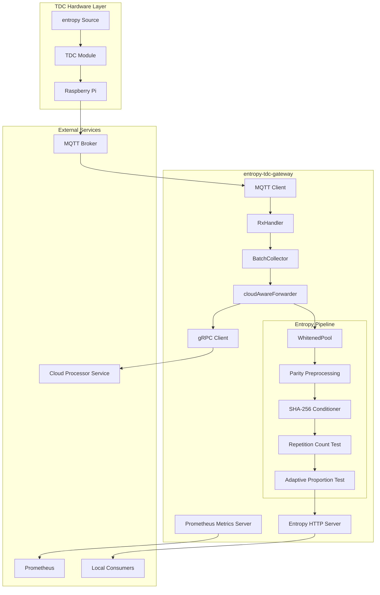
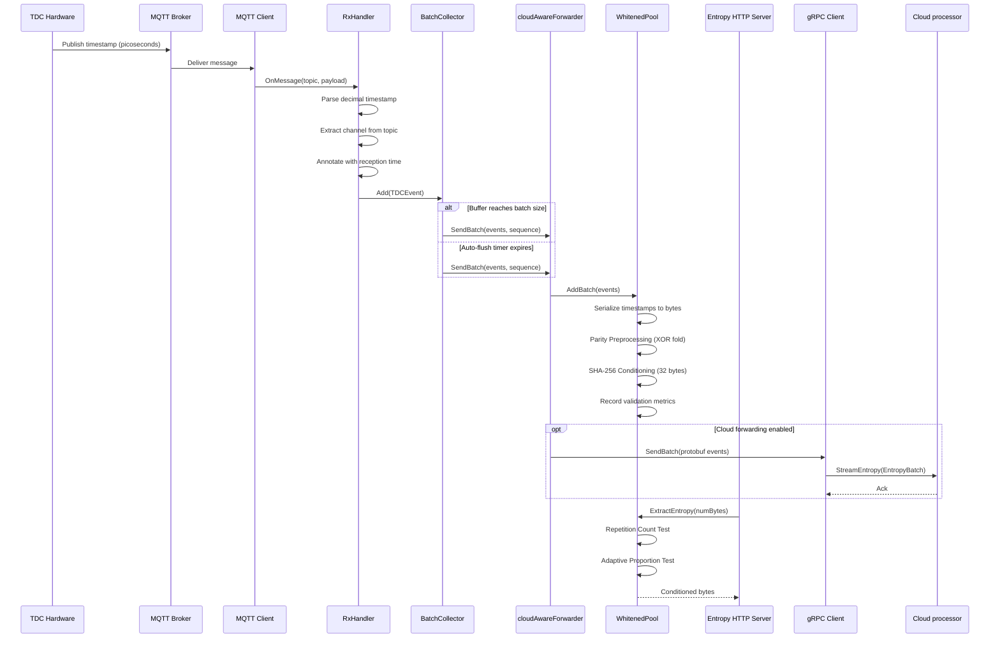

# entropy-tdc-gateway

A Go-based edge gateway service that collects high-quality entropy from Time-to-Digital Converter (TDC) hardware measuring Strontium-90 radioactive decay events. The gateway ingests raw picosecond timestamps via MQTT, applies a dual-stage entropy conditioning pipeline compliant with NIST SP 800-90B, maintains a local whitened entropy pool, and optionally forwards event batches to a cloud processor service via gRPC.

## Table of Contents

1. [Overview](#overview)
2. [Architecture](#architecture)
3. [Module Structure](#module-structure)
4. [Data Flow](#data-flow)
5. [Configuration Reference](#configuration-reference)
6. [Build and Deployment](#build-and-deployment)
7. [HTTP API Reference](#http-api-reference)
8. [Prometheus Metrics](#prometheus-metrics)
9. [Security Model](#security-model)
10. [Detailed Documentation](#detailed-documentation)

## Overview

The entropy-tdc-gateway operates at the edge of the decay-entropy-stream system, deployed on a Raspberry Pi alongside TDC hardware that measures the inter-arrival times of beta particles emitted by a Strontium-90 radioactive source. Each decay event produces a picosecond-resolution timestamp that the TDC publishes to a local MQTT broker. The gateway subscribes to these timestamp topics, aggregates events into fixed-size batches, applies cryptographic conditioning to produce uniform random bytes, and exposes the conditioned output through a local HTTP API.

The primary functions of the gateway are:

1. **MQTT Ingestion** -- Subscribe to TDC timestamp topics and parse raw picosecond payloads
2. **Batch Collection** -- Aggregate events into configurable fixed-size batches with automatic flush
3. **Entropy Conditioning** -- Apply parity preprocessing and SHA-256 conditioning per NIST SP 800-90B
4. **Continuous Health Testing** -- Execute Repetition Count Test and Adaptive Proportion Test on every extraction
5. **Local Entropy Distribution** -- Serve conditioned entropy bytes over a rate-limited HTTP API
6. **Cloud Forwarding** -- Optionally stream event batches to the cloud processor service via bidirectional gRPC

## Architecture

The following diagram illustrates the high-level component architecture of the entropy-tdc-gateway and its position within the broader system.



## Module Structure

The codebase follows the standard Go project layout with internal packages enforcing encapsulation boundaries.

| Directory | Responsibility |
|---|---|
| `cmd/entropy-tdc-gateway/` | Application entry point, startup orchestration, graceful shutdown |
| `internal/mqtt/` | MQTT client wrapping Eclipse Paho, message parsing, event construction |
| `internal/collector/` | Fixed-size batch aggregation with auto-flush and ordered dispatch |
| `internal/entropy/` | Whitened entropy pool, dual-stage conditioning pipeline, HTTP server |
| `internal/validation/` | NIST SP 800-90B health tests, quick statistical tests, min-entropy estimators |
| `internal/grpc/` | Bidirectional streaming gRPC client with OAuth2 and reconnection logic |
| `internal/metrics/` | Prometheus metric registration, recording helpers, HTTP metrics server |
| `internal/config/` | Environment variable loading, validation, file-based secret support |
| `internal/clock/` | Time abstraction interface for deterministic testing |
| `api/proto/v1/` | Protobuf service and message definitions |
| `pkg/pb/` | Generated protobuf Go code |
| `deploy/systemd/` | systemd unit file for production deployment |
| `testutil/` | Shared testing utilities |

## Data Flow

The following sequence diagram depicts the processing of a single TDC event from hardware acquisition through local entropy distribution and optional cloud forwarding.



## Configuration Reference

Configuration is loaded from environment variables with an optional `.env` file (processed via godotenv). The following table documents all supported variables with their defaults and constraints.

### Runtime

| Variable | Default | Description |
|---|---|---|
| `ENVIRONMENT` | `dev` | Runtime environment (`dev` or `prod`). Production mode enforces stricter security validation. |

### MQTT

| Variable | Default | Description |
|---|---|---|
| `MQTT_BROKER_URL` | `tcp://127.0.0.1:1883` | MQTT broker URL. TLS schemes (`ssl://`, `tls://`, `mqtts://`, `tcps://`) enable automatic TLS configuration. |
| `MQTT_CLIENT_ID` | (auto-generated) | MQTT client identifier. When empty, a UUID v4-based identifier is generated. |
| `MQTT_TOPICS` | `timestamps/channel/#` | Comma-separated list of MQTT topic filters. |
| `MQTT_QOS` | `0` | Quality of Service level (0 or 1). |
| `MQTT_USERNAME` | (empty) | MQTT authentication username. |
| `MQTT_PASSWORD` | (empty) | MQTT authentication password. |
| `MQTT_PASSWORD_FILE` | (empty) | Path to file containing MQTT password. Takes precedence over `MQTT_PASSWORD`. |
| `MQTT_TLS_CA_FILE` | (empty) | Path to CA certificate for MQTT TLS verification. |

### Entropy Pool and HTTP Server

| Variable | Default | Description |
|---|---|---|
| `ENTROPY_POOL_MIN_BYTES` | `512` | Minimum whitened bytes retained in pool before extraction is permitted. |
| `ENTROPY_POOL_MAX_BYTES` | `16384` | Maximum whitened bytes stored in pool. Oldest bytes are discarded when exceeded. |
| `ENTROPY_READY_MIN_BYTES` | `1024` | Minimum available bytes for the readiness probe to return HTTP 200. |
| `ENTROPY_HTTP_ADDR` | `127.0.0.1:9797` | Bind address for the entropy HTTP server. Restricted to loopback unless `ALLOW_PUBLIC_HTTP=true`. |
| `ENTROPY_RETRY_AFTER_SEC` | `1` | Default value for the `Retry-After` header on 503 responses. |
| `ALLOW_PUBLIC_HTTP` | `false` | Permit non-loopback bind addresses. In production, requires TLS to be enabled. |
| `ENTROPY_RATE_LIMIT_RPS` | `25` | Sustained request rate for the token-bucket rate limiter. |
| `ENTROPY_RATE_LIMIT_BURST` | `25` | Burst capacity for the token-bucket rate limiter. |
| `ENTROPY_TLS_ENABLED` | `false` | Enable TLS for the entropy HTTP server. |
| `ENTROPY_TLS_CERT_FILE` | (shared `TLS_CERT_FILE`) | Server certificate path. Falls back to the shared `TLS_CERT_FILE` variable. |
| `ENTROPY_TLS_KEY_FILE` | (shared `TLS_KEY_FILE`) | Server private key path. Falls back to the shared `TLS_KEY_FILE` variable. |
| `ENTROPY_TLS_CA_FILE` | (shared `TLS_CA_FILE`) | CA certificate path for mTLS client verification. |
| `ENTROPY_TLS_CLIENT_AUTH` | `none` | mTLS client authentication mode: `none`, `request`, or `require`. |

### Batch Collector

| Variable | Default | Constraints | Description |
|---|---|---|---|
| `COLLECTOR_BATCH_SIZE` | `1840` | 1,840 -- 184,000 | Number of events per batch. Default corresponds to approximately 10 seconds at 184 Hz. |

### Prometheus Metrics

| Variable | Default | Description |
|---|---|---|
| `METRICS_BIND` | `127.0.0.1:8080` | Bind address for the Prometheus metrics HTTP server. |
| `METRICS_ENABLED` | `true` | Enable the metrics server. |
| `METRICS_TLS_ENABLED` | `false` | Enable TLS for the metrics server. |
| `METRICS_TLS_CERT_FILE` | (shared `TLS_CERT_FILE`) | Server certificate path. |
| `METRICS_TLS_KEY_FILE` | (shared `TLS_KEY_FILE`) | Server private key path. |
| `METRICS_TLS_CA_FILE` | (shared `TLS_CA_FILE`) | CA certificate path for mTLS. |
| `METRICS_TLS_CLIENT_AUTH` | `none` | mTLS client authentication mode. |

### Cloud Forwarder (gRPC Client)

| Variable | Default | Description |
|---|---|---|
| `CLOUD_FORWARDER_ENABLED` | `false` | Enable gRPC forwarding to the cloud processor service. |
| `CLOUD_FORWARDER_SERVER_ADDR` | (empty) | gRPC server address (required when enabled). |
| `CLOUD_FORWARDER_TLS_ENABLED` | `false` | Enable TLS for the gRPC connection. |
| `CLOUD_FORWARDER_TLS_CA_FILE` | (shared `TLS_CA_FILE`) | CA certificate for server verification. |
| `CLOUD_FORWARDER_TLS_CERT_FILE` | (shared `TLS_CERT_FILE`) | Client certificate for mTLS. |
| `CLOUD_FORWARDER_TLS_KEY_FILE` | (shared `TLS_KEY_FILE`) | Client private key for mTLS. |
| `CLOUD_FORWARDER_TLS_SERVER_NAME` | (empty) | Expected server name for TLS verification. |
| `CLOUD_FORWARDER_CONNECT_TIMEOUT` | `10` | Connection timeout in seconds. |
| `CLOUD_FORWARDER_RECONNECT_DELAY` | `5` | Initial reconnection delay in seconds. |
| `CLOUD_FORWARDER_MAX_RECONNECT` | `60` | Maximum reconnection delay in seconds (exponential backoff cap). |
| `CLOUD_FORWARDER_STREAM_ROTATE_INTERVAL` | `0s` | Interval to rotate the gRPC stream for token refresh. Requires a duration unit suffix (e.g., `55m`). |
| `CLOUD_FORWARDER_OAUTH2_ENABLED` | `false` | Enable OAuth2 client credentials flow. |
| `CLOUD_FORWARDER_OAUTH2_TOKEN_URL` | (empty) | OAuth2 token endpoint URL. |
| `CLOUD_FORWARDER_OAUTH2_CLIENT_ID` | (empty) | OAuth2 client identifier. |
| `CLOUD_FORWARDER_OAUTH2_CLIENT_SECRET` | (empty) | OAuth2 client secret. |
| `CLOUD_FORWARDER_OAUTH2_CLIENT_SECRET_FILE` | (empty) | Path to file containing the OAuth2 client secret (takes precedence). |
| `CLOUD_FORWARDER_OAUTH2_SCOPES` | (empty) | Space-separated OAuth2 scopes. |

### Shared TLS Variables

| Variable | Description |
|---|---|
| `TLS_CERT_FILE` | Default server certificate path used by all components unless overridden. |
| `TLS_KEY_FILE` | Default server private key path used by all components unless overridden. |
| `TLS_CA_FILE` | Default CA certificate path used by all components unless overridden. |

## Build and Deployment

### Prerequisites

- Go 1.25.5 or later
- Protocol Buffers compiler (`protoc`)
- GNU Make

### Build Commands

```bash
# Install dependencies and developer tools
make deps

# Generate protobuf code and build for the local platform
make build

# Cross-compile for Raspberry Pi (ARM64)
make build-arm64

# Run locally in development mode
make dev

# Run the full test suite
make test

# Run tests with coverage reporting (minimum threshold: 90%)
make coverage

# Run tests with the Go race detector
make test-race

# Run linters (golangci-lint)
make lint

# Deploy to Raspberry Pi via SSH
make deploy
```

### Build Artifacts

| Artifact | Target Platform |
|---|---|
| `build/entropy-tdc-gateway` | x86-64 (development) |
| `build/entropy-tdc-gateway-arm64` | ARM64 (Raspberry Pi production) |

### systemd Deployment

The production deployment uses a systemd unit file located at `deploy/systemd/entropy-tdc-gateway.service`. The service runs under a dedicated `entropy` user with comprehensive security hardening.

Installation path: `/opt/entropy-tdc-gateway/`

Configuration file: `/etc/entropy-tdc-gateway/entropy-tdc-gateway.env`

Key operational parameters:

| Parameter | Value |
|---|---|
| Restart policy | Always, with 10-second delay |
| Memory limit | 512 MB |
| CPU quota | 50% |
| Start limit | 5 attempts per 5 minutes |
| Dependencies | `network-online.target`, `mosquitto.service` |

Security hardening directives applied:

- `NoNewPrivileges=true`
- `PrivateTmp=true`
- `ProtectSystem=strict`
- `ProtectHome=true`
- `MemoryDenyWriteExecute=true`
- `SystemCallFilter=@system-service`
- `RestrictNamespaces=true`
- `RestrictSUIDSGID=true`

## HTTP API Reference

The entropy HTTP server exposes three endpoints under the `/api/v1` base path. By default, the server binds to `127.0.0.1:9797` and restricts access to loopback interfaces.

### GET /api/v1/entropy/binary

Retrieves conditioned entropy bytes from the whitened pool.

**Query Parameters:**

| Parameter | Type | Default | Range | Description |
|---|---|---|---|---|
| `bytes` | integer | 32 | 1 -- 4096 | Number of entropy bytes to return |

**Response Headers:**

| Header | Description |
|---|---|
| `Content-Type` | `application/octet-stream` |
| `X-Entropy-Available` | Number of bytes currently available in the pool |
| `X-Entropy-Request` | Number of bytes requested |
| `Cache-Control` | `no-store` |
| `Pragma` | `no-cache` |
| `Retry-After` | Seconds to wait before retrying (on 503 responses) |

**Status Codes:**

| Code | Condition |
|---|---|
| 200 | Entropy bytes returned successfully |
| 400 | Invalid or out-of-range `bytes` parameter |
| 503 | Insufficient entropy, pool unavailable, or rate limit exceeded |

### GET /api/v1/health

Reports the current status of the entropy pool.

**Response:** Plain text containing `raw_events`, `whitened_bytes`, and `available_bytes` counts.

**Status Code:** 200

### GET /api/v1/ready

Kubernetes-compatible readiness probe.

**Response Headers:**

| Header | Description |
|---|---|
| `X-Entropy-Available` | Current available entropy bytes |
| `X-Ready-Threshold` | Configured readiness threshold |

**Status Codes:**

| Code | Condition |
|---|---|
| 200 | Available entropy meets or exceeds the configured threshold |
| 503 | Available entropy is below the configured threshold |

## Prometheus Metrics

The metrics server exposes a standard Prometheus `/metrics` endpoint. The following table lists key metrics organized by subsystem.

### MQTT Ingestion

| Metric | Type | Labels | Description |
|---|---|---|---|
| `tdc_events_received_total` | Counter | `channel` | Total TDC events received |
| `tdc_events_dropped_total` | Counter | `reason` | Total events dropped |
| `mqtt_connection_status` | Gauge | -- | MQTT connection state (1=connected) |
| `mqtt_reconnects_total` | Counter | -- | MQTT reconnection count |
| `mqtt_in_msgs_total` | Counter | -- | Total inbound MQTT messages |

### Batch Processing

| Metric | Type | Labels | Description |
|---|---|---|---|
| `batch_size_events` | Histogram | -- | Events per batch distribution |
| `batches_sent_total` | Counter | -- | Successfully sent batches |
| `batches_failed_total` | Counter | `reason` | Failed batch transmissions |
| `collector_pool_size_events` | Gauge | -- | Current collector buffer size |

### Entropy Conditioning

| Metric | Type | Labels | Description |
|---|---|---|---|
| `whitening_compression_ratio` | Histogram | -- | Conditioning compression ratio |
| `entropy_pool_size_bytes` | Gauge | -- | Current whitened pool size |
| `continuous_rct_failures_total` | Counter | -- | RCT health test failures |
| `continuous_apt_failures_total` | Counter | -- | APT health test failures |
| `min_entropy_estimate_mcv_bits_per_byte` | Histogram | -- | MCV min-entropy estimate |
| `min_entropy_estimate_collision_bits_per_byte` | Histogram | -- | Collision min-entropy estimate |

### HTTP Entropy API

| Metric | Type | Labels | Description |
|---|---|---|---|
| `entropy_http_requests_total` | Counter | `code` | Requests by status code |
| `entropy_http_rate_limited_total` | Counter | -- | Rate-limited responses |
| `entropy_http_latency_seconds` | Histogram | -- | Request latency distribution |

### gRPC Forwarding

| Metric | Type | Labels | Description |
|---|---|---|---|
| `grpc_connection_status` | Gauge | -- | gRPC connection state (1=connected) |
| `forwarder_reconnects_total` | Counter | -- | Reconnection attempts |
| `grpc_stream_errors_total` | Counter | `error_type` | Stream error count |
| `forwarder_backpressure_total` | Counter | -- | Backpressure signals received |

## Security Model

The entropy-tdc-gateway implements a defense-in-depth security architecture spanning network, authentication, application, and operational layers.

**Network Security:**
- Entropy HTTP API binds exclusively to loopback interfaces by default
- TLS 1.2 or later enforced on all external connections
- Optional mutual TLS (mTLS) for client authentication on all server endpoints
- Separate TLS configuration per component with shared defaults

**Authentication:**
- OAuth2 client credentials flow via Zitadel/OIDC for cloud gRPC communication
- MQTT username/password authentication with file-based secret loading
- X.509 certificate-based authentication through mTLS

**Application Security:**
- Token-bucket rate limiting on the entropy HTTP endpoint
- Input validation on all MQTT payloads with metric recording of rejections
- Continuous NIST SP 800-90B health testing; entropy extraction is blocked on test failure
- Production mode enforces TLS when public HTTP binding is permitted

**Operational Hardening:**
- Dedicated `entropy` service user with minimal privileges
- systemd security directives restricting system calls, namespaces, and filesystem access
- Memory limit of 512 MB and CPU quota of 50%
- Automatic restart with rate limiting (5 attempts per 5 minutes)

## Detailed Documentation

For a comprehensive architectural analysis suitable for academic reference, see [Architecture](docs/architecture.md).