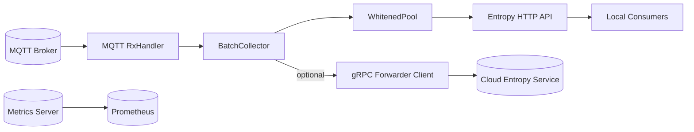
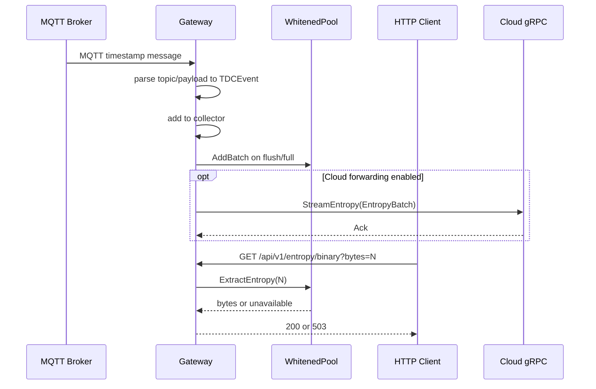

# entropy-tdc-gateway

## Overview

`entropy-tdc-gateway` is a Go-based edge gateway for timestamp-driven entropy acquisition. It consumes Time-to-Digital Converter (TDC) event timestamps from MQTT, performs deterministic batching, conditions timestamps into a bounded local entropy pool, serves entropy over HTTP, and can optionally mirror batches to a cloud gRPC service.

This README summarizes externally relevant architecture and interfaces. A fuller thesis-ready description is available in `docs/architecture.md`.

## Responsibilities

1. Ingest TDC timestamps from MQTT topics.
2. Parse and normalize events into `TDCEvent` records.
3. Aggregate events into fixed-size or timed batches.
4. Feed batches into a local conditioning pipeline.
5. Expose local entropy and health/readiness endpoints.
6. Export Prometheus metrics.
7. Optionally forward batches to cloud over bidirectional gRPC.

## Internal Module Map

| Path | Responsibility |
|---|---|
| `cmd/entropy-tdc-gateway/` | Entry point and runtime orchestration |
| `internal/config/` | Environment parsing, validation, secret-file loading |
| `internal/mqtt/` | MQTT client wrapper and event parser |
| `internal/collector/` | Buffered batching and timed flush |
| `internal/entropy/` | Entropy pool, whitening pipeline, HTTP API |
| `internal/validation/` | Statistical quick tests and continuous health tests |
| `internal/grpc/` | Outbound cloud forwarding client |
| `internal/metrics/` | Prometheus metrics and metrics HTTP server |
| `api/openapi.yaml` | HTTP API contract document |
| `api/proto/v1/entropy.proto` | gRPC and message schema |

## High-Level Architecture



## Runtime Flow



## Exposed Interfaces

### 1. Entropy HTTP API

Base path: `/api/v1`

| Endpoint | Method | Description |
|---|---|---|
| `/entropy/binary` | `GET` | Return binary entropy bytes (`bytes` query parameter, `1..4096`, default `32`) |
| `/health` | `GET` | Return plain-text counters: raw events, whitened bytes, available bytes |
| `/ready` | `GET` | Readiness probe based on configurable minimum available bytes |
| `/openapi` | `GET` | Serve OpenAPI document file |

Key behavior:

1. Token-bucket rate limiting on `/entropy/binary`.
2. `503` with `Retry-After` when insufficient entropy or rate-limited.
3. Continuous health tests (RCT/APT) on extracted blocks.
4. Loopback-only bind by default unless explicitly configured otherwise.

### 2. gRPC Outbound Interface

Defined by `api/proto/v1/entropy.proto`, implemented client-side in `internal/grpc`.

Primary active stream:

- `EntropyStream.StreamEntropy(stream EntropyBatch) returns (stream Ack)`

The gateway sends batches and receives acknowledgements including backpressure and missing-sequence signals.

### 3. Metrics Interface

Metrics server endpoints:

1. `GET /api/v1/metrics`
2. `GET /api/v1/health`

Metrics cover event ingestion, drops, collector behavior, whitening throughput, pool state, HTTP request outcomes, and gRPC connectivity.

## Configuration

Configuration is environment-driven (`internal/config`). The most relevant groups are:

1. MQTT connection and topic subscription (`MQTT_*`).
2. Collector batch policy (`COLLECTOR_BATCH_SIZE`).
3. Entropy pool and HTTP service (`ENTROPY_*`, `ALLOW_PUBLIC_HTTP`).
4. Metrics service (`METRICS_*`).
5. Cloud forwarding (`CLOUD_FORWARDER_*`).
6. Shared TLS fallback paths (`TLS_CERT_FILE`, `TLS_KEY_FILE`, `TLS_CA_FILE`).

Reference file: `.env.example`

## Build and Run

Prerequisites:

1. Go 1.25+
2. `protoc`
3. GNU Make

Common commands:

```bash
make proto
make build
make test
make dev
```

## Deployment Artifacts

| File | Purpose |
|---|---|
| `Dockerfile` | Multi-stage image build for gateway binary |
| `deploy/systemd/entropy-tdc-gateway.service` | Hardened Linux service unit |
| `.env.example` | Environment template |

## Documentation Consistency Notes

The repository currently contains several interface-level mismatches that should be considered during deployment and thesis interpretation:

1. `api/openapi.yaml` declares bearer authentication globally, while HTTP handlers in `internal/entropy/http_entropy_server.go` do not implement auth checks.
2. `.env.example` includes `PROM_METRICS_ENABLED`, but configuration code reads `METRICS_ENABLED`.
3. `METRICS_ENABLED` is parsed but not consulted in `main.go` before starting the metrics server.

## Additional Documentation

1. Detailed architecture chapter: `docs/architecture.md`
2. HTTP API specification: `api/openapi.yaml`
3. gRPC schema: `api/proto/v1/entropy.proto`
