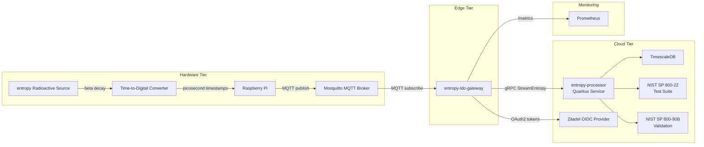
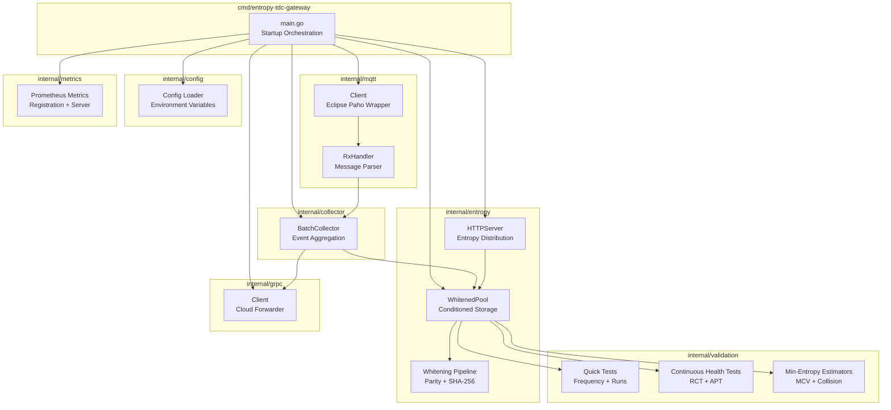
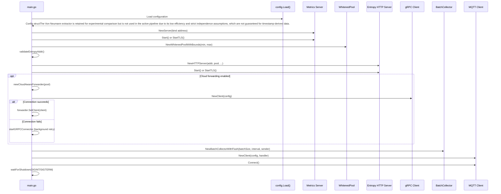
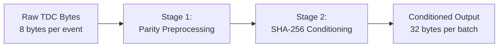
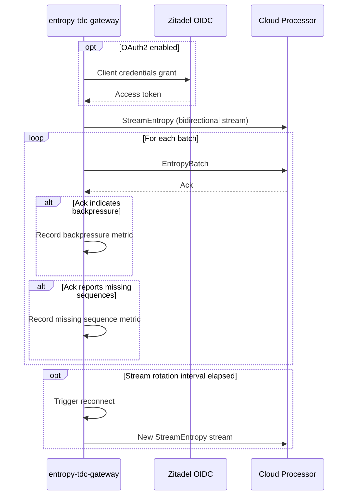
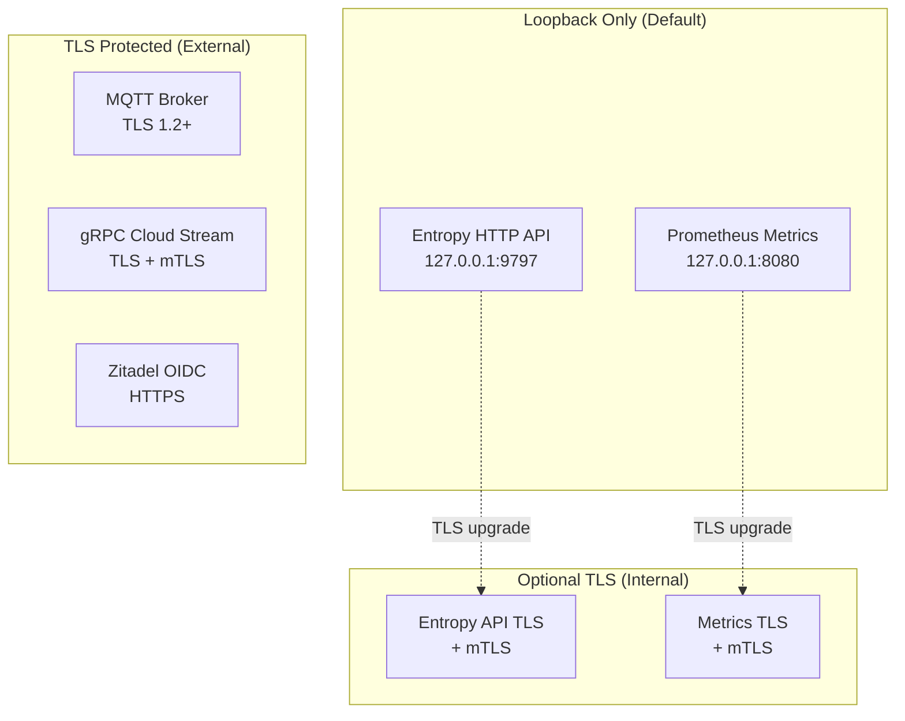

# Entropy TDC Gateway -- Architecture Document

## 1. Introduction

This document provides a formal architectural description of the entropy-tdc-gateway, a Go-based edge gateway service within the decay-entropy-stream system. The gateway is responsible for collecting, conditioning, validating, and distributing entropy derived from Time-to-Digital Converter (TDC) measurements of Strontium-90 radioactive decay events. This document is structured for direct incorporation into an academic thesis and follows a top-down decomposition from system context through component architecture to interface specifications.

## 2. System Context

The entropy-tdc-gateway occupies the edge tier of a three-tier architecture spanning hardware acquisition, edge processing, and cloud processor.

The Strontium-90 source emits beta particles whose detection times are measured by the TDC with picosecond resolution. A Raspberry Pi reads these timestamps and publishes them as MQTT messages to a local Mosquitto broker. The entropy-tdc-gateway subscribes to the relevant MQTT topics, processes the raw timestamps through an entropy conditioning pipeline, and serves the conditioned output to local consumers via an HTTP API. When cloud forwarding is enabled, the gateway additionally streams raw event batches to the entropy-processor Quarkus microservice for comprehensive NIST statistical validation and persistent storage in TimescaleDB.

### 2.1 Design Rationale

The edge gateway architecture was chosen for several reasons:

1. **Latency Minimization** -- Local entropy conditioning and distribution eliminate network round-trip dependencies for consumers requiring immediate access to random bytes.
2. **Resilience** -- The gateway operates independently of cloud connectivity, continuing to condition and serve entropy during network partitions.
3. **Data Reduction** -- The dual-stage conditioning pipeline compresses raw timestamp data (8 bytes per event) into 32-byte SHA-256 digests, substantially reducing the volume of data transmitted to the cloud.
4. **Security Boundary** -- The gateway enforces loopback-only access by default, restricting entropy distribution to co-located processes on the Raspberry Pi.

## 3. Component Architecture

### 3.1 Internal Component Overview

The gateway is decomposed into seven principal internal packages, each with a single well-defined responsibility.

### 3.2 Startup Sequence

The application entry point in `main.go` orchestrates subsystem initialization in a specific order that respects dependency relationships.

The startup order ensures that monitoring infrastructure (Prometheus metrics) is available before any processing begins, that the entropy pool exists before the HTTP server starts accepting requests, and that the MQTT client -- which initiates the event flow -- is the last component to connect. Graceful shutdown reverses this order: MQTT is disconnected first, followed by the collector flush, then the HTTP servers.

## 4. Module Boundary Descriptions

### 4.1 MQTT Client (internal/mqtt)

The MQTT package provides a receive-only client built on the Eclipse Paho library. It is responsible for broker connection management, topic subscription, and raw message dispatch.

**Key Types:**

- `Client` -- Wraps `paho.Client` with auto-reconnect, TLS support, and connection lifecycle tracking. Generates a UUID v4-based client identifier when none is configured.
- `Config` -- Holds broker URL, client ID, topic filters, QoS level, and authentication credentials.
- `RxHandler` -- Implements the `Handler` interface by parsing raw MQTT payloads into `TDCEvent` structures and forwarding them to a `Collector`.
- `TDCEvent` -- Represents a single TDC measurement with fields for the gateway ingestion timestamp (`RpiTimestampUs`), TDC picosecond timestamp (`TdcTimestampPs`), channel number (`Channel`), and optional delta and flags fields.

**Parsing Logic:**

Raw MQTT payloads contain a single decimal unsigned 64-bit integer representing a picosecond timestamp. The handler trims whitespace, parses the integer, extracts the channel number from the trailing numeric segment of the MQTT topic path, and annotates the event with the current gateway time in microseconds. Metadata topics ending with `/meta` are ignored and are not treated as TDC events.

**Connection Management:**

- Auto-reconnect is enabled by default with a 20-second keep-alive interval
- Clean session is disabled to preserve subscription state across reconnections
- TLS is automatically configured when the broker URL uses `ssl://`, `tls://`, `mqtts://`, or `tcps://` schemes
- TLS minimum version is 1.2
- Custom CA certificates are supported via `TLSCAFile`; otherwise, the system certificate pool is used
- Initial connection blocks for up to 10 seconds, including topic subscription completion

### 4.2 Batch Collector (internal/collector)

The collector package aggregates individual TDC events into fixed-size batches for efficient downstream processing.

**Key Types:**

- `BatchCollector` -- Thread-safe event buffer with configurable maximum size and auto-flush interval. Dispatches completed batches through a `BatchSender` interface.
- `BatchSender` -- Interface abstracting the downstream consumer of event batches. Production implementations include the `cloudAwareForwarder` (which feeds both the local pool and the optional gRPC stream) and a local-only pool sender.

**Operational Behavior:**

The collector maintains an internal buffer that triggers a flush under two conditions:

1. **Buffer Full** -- When the number of buffered events reaches `maxSize`, the batch is immediately enqueued for dispatch.
2. **Auto-Flush Timer** -- A background goroutine periodically flushes partial batches to ensure low-throughput periods do not leave events buffered indefinitely. The default interval is computed as `batchSize / 184.0` seconds, reflecting the expected 184 Hz event rate.

A single send goroutine drains the dispatch queue, preserving batch ordering. The queue capacity is set to `max(1, maxSize/2)` to provide backpressure without excessive memory allocation. The collector supports the functional options pattern (`WithClock`) for injecting a custom clock implementation during testing.

**Configuration Constraints:**

| Parameter | Minimum | Maximum | Default |
|---|---|---|---|
| Batch size | 1,840 events | 184,000 events | 1,840 events |

The default batch size of 1,840 events corresponds to approximately 10 seconds of data collection at 184 Hz, yielding 32 bytes of conditioned output per batch (approximately 3.2 bytes per second of sustained entropy production).

### 4.3 Entropy Pipeline (internal/entropy)

The entropy package is the central component of the gateway, managing the conditioned entropy pool, the whitening pipeline, and the HTTP distribution server. It is decomposed into three functional units.

#### 4.3.1 Whitened Pool (pool.go)

The `WhitenedPool` is a thread-safe, bounded buffer of conditioned entropy bytes. It maintains both a diagnostic history of raw events (capped at 4,096 events) and the primary whitened byte storage.

**Pool Lifecycle:**

1. **Ingestion** (`AddBatch`) -- Serializes TDC event timestamps into a raw byte stream (8 bytes per event, little-endian), applies the dual-stage whitening pipeline, records validation metrics, and appends the conditioned output to the pool. Both the raw event history and the whitened buffer are trimmed to their respective upper bounds.

2. **Extraction** (`ExtractEntropy`) -- Removes exactly the requested number of bytes from the pool, subject to three preconditions:
   - The pool contains at least `minPoolSize` bytes (the minimum reserve)
   - Sufficient bytes are available to satisfy the request
   - Both the Repetition Count Test and Adaptive Proportion Test pass on the output block

   If any precondition fails, the extraction returns `(nil, false)`. On health test failure, the corresponding test state is reset to permit recovery without operator intervention.

3. **Availability Reporting** (`AvailableEntropy`) -- Returns the number of bytes above the minimum reserve that are available for extraction.

**Configurable Bounds:**

| Parameter | Default | Description |
|---|---|---|
| `minPoolSize` | 512 bytes | Minimum reserve; extraction is blocked below this threshold |
| `maxPoolSize` | 16,384 bytes | Upper bound on stored whitened bytes |
| `maxRawEvents` | 4,096 events | Maximum diagnostic event history |

#### 4.3.2 Whitening Pipeline (whitening.go)

The conditioning pipeline transforms raw TDC timestamp bytes into cryptographically conditioned output through two sequential stages.

**Stage 1: Parity Preprocessing**

The `ParityPreprocess` function performs a sliding XOR operation across adjacent byte pairs, producing `len(input) - 1` output bytes. For each index `i`, the output byte is computed as `input[i] XOR input[i+1]`. This operation reduces local correlations in the raw timestamp data before the hash conditioning stage.

**Stage 2: SHA-256 Conditioning**

The `SHA256Conditioner` function computes the SHA-256 hash of the preprocessed byte stream, producing exactly 32 bytes of output per invocation. This stage is compliant with NIST SP 800-90B conditioning requirements, which specify the use of approved hash functions to compress raw entropy into a fixed-length output with near-uniform distribution.

**Combined Pipeline:**

The `DualStageWhitening` function chains both stages: it applies parity preprocessing to the raw input and then SHA-256 conditioning to the result. The function returns `nil` if the input contains fewer than two bytes (insufficient for the XOR fold).

The package also contains an unused `VonNeumannExtractor` implementation, which applies the classic Von Neumann debiasing algorithm to individual bit pairs. This extractor is not currently invoked in the active conditioning pipeline.

The Von Neumann extractor is retained for experimental comparison only and is not used in the active pipeline due to its low efficiency and its reliance on independence assumptions between consecutive bits. These assumptions are not guaranteed for timestamp-derived data, where temporal correlations may be present.
#### 4.3.3 HTTP Entropy Server (http_entropy_server.go)

The `HTTPServer` exposes three endpoints under the `/api/v1` base path for local entropy distribution and health monitoring.

**Endpoint Architecture:**

| Endpoint | Method | Content-Type | Purpose |
|---|---|---|---|
| `/api/v1/entropy/binary` | GET | `application/octet-stream` | Retrieve conditioned entropy bytes |
| `/api/v1/health` | GET | `text/plain` | Pool diagnostic status |
| `/api/v1/ready` | GET | `text/plain` | Kubernetes-compatible readiness probe |

**Rate Limiting:**

A token-bucket rate limiter protects the entropy endpoint. The bucket refills at a configurable rate (default 25 tokens per second) with a configurable burst capacity (default 25 tokens). When the bucket is empty, the server responds with HTTP 503 and a `Retry-After` header indicating the minimum wait time.

**Security Enforcement:**

The server validates the bind address against loopback interfaces (`127.0.0.1`, `::1`, `localhost`) during construction. Non-loopback addresses are rejected unless `ALLOW_PUBLIC_HTTP=true` is explicitly configured. In production mode, enabling public HTTP without TLS results in a configuration validation error.

**Server Configuration:**

| Parameter | Value |
|---|---|
| Default address | `127.0.0.1:9797` |
| Read timeout | 5 seconds |
| Write timeout | 5 seconds |
| Idle timeout | 30 seconds |
| Shutdown timeout | 5 seconds |
| Request size range | 1 -- 4,096 bytes |
| Default request size | 32 bytes |

### 4.4 Validation (internal/validation)

The validation package implements entropy quality assessment routines organized into three categories: quick statistical tests, continuous health tests, and min-entropy estimators.

#### 4.4.1 Quick Statistical Tests

These tests provide rapid feedback on conditioned output quality and are executed on every batch added to the whitened pool.

**Frequency Test:**

Evaluates bit balance by computing the ratio of set bits to total bits in the conditioned output. The test passes when the observed ratio falls within the interval [0.45, 0.55], centered on the ideal value of 0.5 for a uniform random bitstream.

**Runs Test:**

Evaluates bit alternation by counting uninterrupted sequences of identical bit values. The test passes when the observed run count deviates by less than 10% from the expected value of n/2, where n is the total number of bits.

Both tests record their results as Prometheus metrics but do not gate entropy extraction; they serve as diagnostic indicators.

#### 4.4.2 Continuous Health Tests (NIST SP 800-90B Section 4.4)

These tests are mandated by NIST SP 800-90B for all noise sources and are applied during every entropy extraction from the whitened pool.

**Repetition Count Test (RCT):**

Detects stuck-at faults by counting consecutive identical byte values. The test fails when a single value repeats C or more consecutive times. The cutoff C is derived from the false-positive probability alpha, with the default cutoff of 40 corresponding to alpha = 2^-40.

| Parameter | Value | Derivation |
|---|---|---|
| Cutoff (C) | 40 | alpha = 2^-40 |
| Sample unit | byte (8 bits) | -- |
| State | Persistent across extractions | Reset on failure |

**Adaptive Proportion Test (APT):**

Detects statistical bias by measuring how often the first sample in a window of W samples recurs. The test fails when the recurrence count reaches the cutoff C.

| Parameter | Value | Derivation |
|---|---|---|
| Cutoff (C) | 605 | alpha = 2^-40, H = 0.5 |
| Window size (W) | 4,096 bytes | NIST SP 800-90B default |
| State | Persistent across extractions | Reset on failure |

Both continuous health tests are thread-safe and maintain persistent state across extraction calls. On failure, the corresponding extraction is rejected (returning no data), the failure is recorded in Prometheus metrics, and the test state is reset to allow recovery.

#### 4.4.3 Min-Entropy Estimators (NIST SP 800-90B Section 6)

Two min-entropy estimation methods quantify the unpredictability of the conditioned output.

**Most Common Value (MCV) Estimator (Section 6.3.1):**

Computes min-entropy as `-log2(p_max)`, where `p_max` is the relative frequency of the most common byte value in the sample. The result ranges from 0.0 (all identical values) to 8.0 (perfectly uniform distribution across all 256 byte values).

**Collision Estimator (Section 6.3.2):**

Locates the first repeated byte value in the sample and computes `log2(t)`, where `t` is the one-indexed position of the collision. Earlier collisions indicate lower entropy. The result is clamped to [0.0, 8.0].

**Conservative Estimate:**

The `EstimateMinEntropyConservative` function returns the minimum of the MCV and Collision estimates, following NIST SP 800-90B guidance that the most conservative estimator should be used for security applications.

### 4.5 gRPC Cloud Forwarder (internal/grpc)

The gRPC package implements a bidirectional streaming client for forwarding entropy batches to the cloud processor service.

**Connection Lifecycle:**

1. The client uses the `go-authx` library's builder pattern to configure the gRPC connection with optional OAuth2 and TLS support.
2. Upon successful connection, a bidirectional `StreamEntropy` stream is opened.
3. A background goroutine continuously reads `Ack` messages from the server.
4. When stream rotation is configured, a timer triggers a reconnection after the specified interval to refresh OAuth2 tokens.

**Reconnection Strategy:**

When a send or receive error occurs, the client marks itself as disconnected and launches an asynchronous reconnection loop with exponential backoff. Only one reconnection loop runs concurrently, enforced by a mutex-protected flag.

| Parameter | Default | Description |
|---|---|---|
| Initial delay | 5 seconds | Time before first reconnection attempt |
| Maximum delay | 60 seconds | Exponential backoff cap |
| Backoff factor | 2x | Delay doubles after each failure |

**Integration via cloudAwareForwarder:**

The main application wraps the gRPC client in a `cloudAwareForwarder` structure that serves as the `BatchSender` for the collector. This forwarder always feeds batches to the local whitened pool and, when a gRPC client is attached, mirrors the batch to the cloud. The gRPC client reference is stored in an `atomic.Pointer`, allowing the client to be injected or replaced at runtime without blocking batch processing.

### 4.6 Prometheus Metrics (internal/metrics)

The metrics package registers and records Prometheus metrics for all gateway subsystems. Metrics are organized into the following categories:

- **MQTT Ingestion** -- Event counts by channel, dropped events by reason, connection state, reconnection counts
- **Batch Processing** -- Batch size distribution, send duration, creation and failure counts
- **Entropy Conditioning** -- Whitening input/output bytes, compression ratio, pool size
- **Validation** -- Frequency ratio distribution, runs count distribution, test failure counts
- **Continuous Health** -- RCT failure count, APT failure count, MCV and Collision min-entropy distributions
- **HTTP Entropy API** -- Request counts by status code, 503 totals, rate-limited totals, latency distribution
- **gRPC Forwarding** -- Connection state, reconnection count, stream errors by type, backpressure events, missing sequence reports, ack/nack counts

The metrics package supports test isolation through `SetRegisterer`, which allows each test to use an independent Prometheus registry to avoid metric name collisions.

### 4.7 Configuration Management (internal/config)

The configuration system loads settings from environment variables with an optional `.env` file (processed by the `godotenv` library using `Overload` semantics, meaning file values are overridden by pre-existing environment variables).

**Configuration Groups:**

The top-level `Config` struct contains the following nested groups:

| Group | Struct | Responsibility |
|---|---|---|
| MQTT | `MQTT` | Broker connection, topics, authentication |
| EntropyPool | `EntropyPool` | Pool bounds, HTTP server, TLS, rate limiting |
| Collector | `Collector` | Batch size |
| Metrics | `Metrics` | Prometheus server bind, TLS |
| CloudForwarder | `CloudForwarder` | gRPC client, TLS, OAuth2, reconnection |
| Environment | `string` | Runtime mode (`dev` or `prod`) |

**Security Features:**

- File-based secrets via `_FILE` suffixes (`MQTT_PASSWORD_FILE`, `CLOUD_FORWARDER_OAUTH2_CLIENT_SECRET_FILE`)
- Absolute path sanitization and `os.OpenInRoot` for safe file reading
- Inline comment stripping for compatibility with systemd `EnvironmentFile` format
- TLS validation enforcing certificate and key pair completeness
- Production mode requiring TLS for public HTTP endpoints
- Shared TLS variable fallback (`TLS_CERT_FILE`, `TLS_KEY_FILE`, `TLS_CA_FILE`) with component-specific overrides

## 5. NIST SP 800-90B Compliance

The entropy-tdc-gateway implements several provisions from NIST Special Publication 800-90B (Recommendation for the Entropy Sources Used for Random Bit Generation).

### 5.1 Conditioning Component

The dual-stage whitening pipeline serves as the conditioning component per Section 3.1.5 of SP 800-90B. The SHA-256 hash function in Stage 2 is an approved conditioning function. The parity preprocessing in Stage 1 provides an additional correlation reduction step before conditioning.

For a batch of N events, the conditioning pipeline produces:

- **Input**: N x 8 bytes of serialized picosecond timestamps
- **After parity preprocessing**: (N x 8) - 1 bytes
- **After SHA-256 conditioning**: 32 bytes

The compression ratio is recorded in the `whitening_compression_ratio` Prometheus metric for ongoing monitoring.

### 5.2 Continuous Health Tests (Section 4.4)

Both mandatory health tests are implemented and applied continuously during entropy extraction:

1. **Repetition Count Test (Section 4.4.1)** -- Applied to every byte block extracted from the pool. The cutoff of 40 consecutive identical bytes provides a false-positive probability of alpha = 2^-40.

2. **Adaptive Proportion Test (Section 4.4.2)** -- Applied with a window size of 4,096 bytes and a cutoff of 605 matches, corresponding to alpha = 2^-40 with a minimum entropy assumption of H = 0.5 bits per byte.

### 5.3 Min-Entropy Estimation (Section 6)

Two estimators from Section 6.3 are computed on every conditioned batch:

1. **Most Common Value (Section 6.3.1)** -- Provides an upper bound on the maximum probability of any symbol.
2. **Collision (Section 6.3.2)** -- Provides a complementary estimate based on the birthday paradox.

The conservative estimate (minimum of both methods) follows the SP 800-90B recommendation for security applications.

### 5.4 Health Test Failure Handling

When a continuous health test failure is detected during extraction, the gateway:

1. Rejects the extraction, returning no data to the consumer
2. Records the failure in Prometheus metrics (`continuous_rct_failures_total` or `continuous_apt_failures_total`)
3. Records a dropped event metric with the appropriate reason (`rct_failure` or `apt_failure`)
4. Resets the failed test to its initial state, permitting automatic recovery
5. Logs a warning message

This fail-safe approach ensures that potentially degraded entropy is never distributed while allowing the system to recover without manual intervention.

## 6. Security Architecture

### 6.1 Network Security

The gateway enforces a strict network isolation model:

- **Default loopback binding** -- Both the entropy HTTP API and the Prometheus metrics server bind exclusively to loopback addresses. The `enforceLoopbackAddr` function in the HTTP server and the `validateEntropyAddr` function in `main.go` reject non-loopback addresses unless explicitly overridden.

- **TLS minimum version** -- All TLS configurations enforce TLS 1.2 as the minimum protocol version.

- **Per-component TLS** -- Each server component (entropy HTTP, metrics, gRPC) supports independent TLS configuration, with shared `TLS_CERT_FILE`, `TLS_KEY_FILE`, and `TLS_CA_FILE` variables providing defaults that can be overridden by component-specific variables.

- **Mutual TLS** -- All server endpoints support configurable mTLS client authentication with three modes: `none` (no client certificate required), `request` (client certificate requested but not required), and `require` (client certificate mandatory and verified against the configured CA).

### 6.2 Authentication

The gateway employs three authentication mechanisms, each appropriate to its communication context:

| Channel | Mechanism | Implementation |
|---|---|---|
| MQTT | Username/Password | Paho client options; passwords support file-based loading |
| gRPC | OAuth2 Client Credentials | `go-authx` library with Zitadel/OIDC token endpoint |
| HTTP Entropy API | mTLS (optional) | X.509 client certificates verified against trusted CA |

### 6.3 Application Security

- **Input Validation** -- All MQTT payloads are validated during parsing. Zero-value timestamps and unparseable payloads are rejected with metric recording.
- **Rate Limiting** -- The entropy HTTP endpoint implements a token-bucket rate limiter to prevent resource exhaustion.
- **Health Test Gating** -- Entropy extraction is blocked when continuous health tests detect anomalies, preventing distribution of potentially degraded output.
- **Production Mode Enforcement** -- The configuration validator rejects insecure combinations in production mode, specifically public HTTP without TLS.

### 6.4 Operational Hardening

The systemd unit file applies a comprehensive set of security directives:

| Directive | Effect |
|---|---|
| `User=entropy` | Runs under a dedicated non-root user |
| `NoNewPrivileges=true` | Prevents privilege escalation |
| `ProtectSystem=strict` | Mounts the file system read-only except for explicit write paths |
| `ProtectHome=true` | Makes home directories inaccessible |
| `PrivateTmp=true` | Provides an isolated temporary file system |
| `MemoryDenyWriteExecute=true` | Prevents creation of writable-executable memory mappings |
| `SystemCallFilter=@system-service` | Restricts available system calls to a minimal set |
| `SystemCallArchitectures=native` | Blocks foreign-architecture system calls |
| `RestrictNamespaces=true` | Prevents namespace creation |
| `RestrictSUIDSGID=true` | Blocks SUID/SGID file creation |
| `LockPersonality=true` | Locks the execution domain |
| `RemoveIPC=true` | Cleans IPC resources on service stop |
| `ProtectKernelTunables=true` | Makes `/proc` and `/sys` tunables read-only |
| `ProtectKernelModules=true` | Blocks kernel module operations |
| `ProtectControlGroups=true` | Makes cgroup hierarchy read-only |
| `RestrictRealtime=true` | Prevents real-time scheduling |

## 7. Deployment Model

### 7.1 Target Environment

The gateway is designed for deployment on a Raspberry Pi running Linux. The `make build-arm64` target produces an ARM64 binary, and the `make deploy` target automates deployment via SSH to the target device.

### 7.2 Resource Constraints

| Resource | Limit |
|---|---|
| Memory | 512 MB maximum |
| CPU | 50% quota |
| Open files | 65,536 |
| Processes | 512 |

### 7.3 Service Dependencies

The systemd unit declares dependencies on `network-online.target` and `mosquitto.service`, ensuring that network connectivity and the local MQTT broker are available before the gateway starts.

### 7.4 Restart Policy

The service is configured with `Restart=always` and `RestartSec=10s`, providing automatic recovery from crashes. A start rate limit of 5 attempts per 5 minutes (`StartLimitIntervalSec=5min`, `StartLimitBurst=5`) prevents excessive restart loops.

## 8. Observability

### 8.1 Prometheus Metrics

The gateway exposes a comprehensive set of Prometheus metrics covering all subsystems. The metrics server runs on a configurable bind address (default `127.0.0.1:8080`) and serves the standard `/metrics` endpoint.

Key operational metrics and their interpretations:

| Metric | Healthy Range | Interpretation |
|---|---|---|
| `mqtt_connection_status` | 1 | MQTT broker connectivity |
| `entropy_pool_size_bytes` | 512 -- 16,384 | Pool operating within configured bounds |
| `min_entropy_estimate_mcv_bits_per_byte` | 4.0 -- 8.0 | Adequate entropy density |
| `continuous_rct_failures_total` | 0 (monotonic) | Absence of stuck-at faults |
| `continuous_apt_failures_total` | 0 (monotonic) | Absence of statistical bias |
| `validation_frequency_ratio` | 0.45 -- 0.55 | Bit balance within acceptable range |

### 8.2 Health Endpoints

| Endpoint | Purpose | Response |
|---|---|---|
| `GET /api/v1/health` | Diagnostic status | Raw event count, whitened bytes, available bytes |
| `GET /api/v1/ready` | Readiness probe | HTTP 200 when available entropy exceeds threshold; HTTP 503 otherwise |

## 9. gRPC Protocol Design

### 9.1 Service Definition

The `EntropyStream` service defines three RPC methods:

| Method | Pattern | Description |
|---|---|---|
| `StreamEntropy` | Client streaming (bidirectional) | Edge-to-cloud batch transmission with acknowledgments |
| `SubscribeBatches` | Server streaming | Cloud-to-consumer batch broadcast |
| `Control` | Bidirectional streaming | Control plane for configuration, health, and keepalive |

### 9.2 Key Message Types

**EntropyBatch** -- The primary data message containing:
- Ordered sequence of `TDCEvent` messages
- Edge-computed quality metrics (`EdgeMetrics`)
- Batch metadata (timestamp, sequence number, source identifier, observation window)
- Integrity fields (checksum, optional digital signature)
- Compression indicator
- Optional whitening statistics and test summary

**TDCEvent** -- A single measurement containing:
- `rpi_timestamp_us` -- Gateway ingestion timestamp in microseconds (set when the MQTT message is received)
- `tdc_timestamp_ps` -- TDC hardware timestamp in picoseconds
- `channel` -- TDC input channel number
- `delta_ps` -- Optional inter-event time difference
- `flags` -- Optional hardware condition flags

**Ack** -- Cloud-to-edge acknowledgment containing:
- Success/failure indication
- Received sequence number
- Human-readable status message
- Missing sequence numbers for gap detection
- Optional backpressure signal with reason

**ControlMessage** -- Union wrapper for control plane messages:
- `Hello` -- Initial handshake with device identification
- `ConfigUpdate` -- Runtime parameter tuning (batch size, rate limits, test windows)
- `HealthReport` -- Operational status from the edge
- `Ping`/`Pong` -- Keepalive probes

### 9.3 Integrity and Authentication

The protobuf schema supports batch integrity verification through SHA-256 checksums and Ed25519 digital signatures. Zstandard compression is available for event payload size reduction.

## 10. Interface Design and Abstractions

The gateway employs several interface-based abstractions to support testability and modularity.

| Interface | Package | Purpose |
|---|---|---|
| `BatchSender` | `collector` | Abstracts downstream batch consumption (pool, cloud, or test double) |
| `Handler` | `mqtt` | Abstracts MQTT message processing |
| `Collector` | `mqtt` | Abstracts event aggregation (used by `RxHandler`) |
| `Clock` | `clock` | Time abstraction for deterministic testing |
| `entropyServer` | `main` | Abstracts the entropy HTTP server lifecycle |
| `metricsServer` | `main` | Abstracts the metrics HTTP server lifecycle |
| `mqttClient` | `main` | Abstracts the MQTT client lifecycle |

The `cloudAwareForwarder` in `main.go` implements the `BatchSender` interface, composing the local pool write and optional gRPC forwarding into a single batch dispatch path. The gRPC client is stored as an `atomic.Pointer`, enabling lock-free reads during batch sending while supporting deferred or retried connection establishment.

The functional options pattern is used for `BatchCollector` construction (`WithClock`), allowing test code to inject deterministic time sources without modifying production initialization paths.
