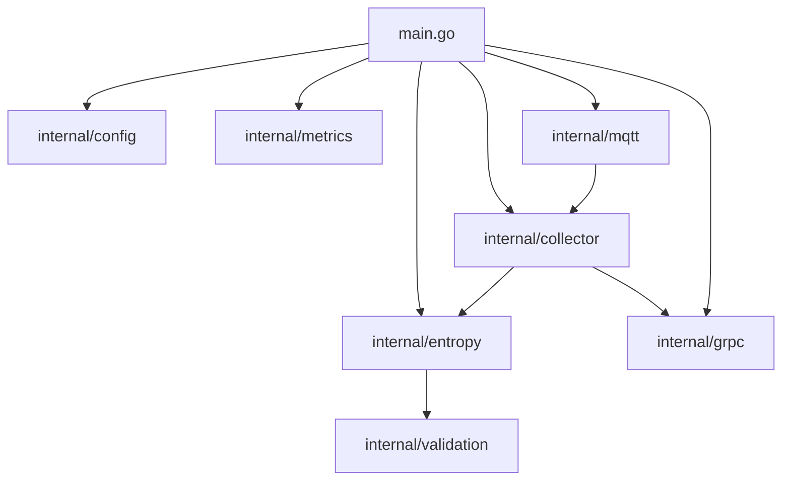
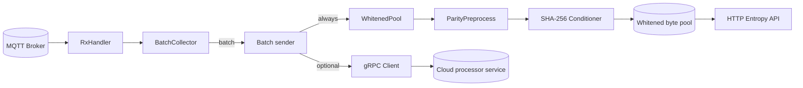
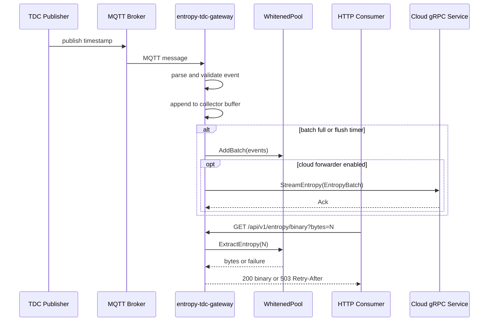

# Entropy TDC Gateway Architecture

## 1. Scope and Evidence Basis

This document describes the architecture implemented under `entropy-tdc-gateway/` in this repository. It is restricted to behavior and interfaces visible from source code and configuration artifacts in that folder.

Primary evidence locations:

1. `cmd/entropy-tdc-gateway/main.go`
2. `internal/*` packages
3. `api/openapi.yaml`
4. `api/proto/v1/entropy.proto`
5. `.env.example`, `Dockerfile`, and `deploy/systemd/entropy-tdc-gateway.service`

## 2. Architectural Role

`entropy-tdc-gateway` is an edge service that ingests TDC timestamp events from MQTT, aggregates events into batches, conditions timestamp bytes into a local entropy pool, exposes entropy over HTTP, and optionally forwards event batches to a cloud gRPC endpoint.

The implemented runtime path is orchestrated in `cmd/entropy-tdc-gateway/main.go`:

1. Load configuration from environment variables.
2. Start Prometheus metrics HTTP server.
3. Create local `WhitenedPool`.
4. Start entropy HTTP server.
5. Optionally initialize cloud forwarder (`internal/grpc` client).
6. Start batch collector.
7. Connect MQTT client and subscribe to configured topics.

## 3. Internal Structure and Module Boundaries

### 3.1 Package Responsibilities

| Package | Responsibility | Boundary Type |
|---|---|---|
| `cmd/entropy-tdc-gateway` | Process bootstrap, dependency wiring, lifecycle management, graceful shutdown | Composition root |
| `internal/config` | Environment-driven configuration model, parsing, validation, and secret file loading | Configuration boundary |
| `internal/mqtt` | MQTT connectivity (Paho), topic subscription, message parsing into `TDCEvent` | Ingestion boundary |
| `internal/collector` | Fixed-size buffering and timed flush of events; ordered dispatch through `BatchSender` | Buffering boundary |
| `internal/entropy` | Entropy pool, conditioning pipeline, HTTP entropy API server | Entropy serving boundary |
| `internal/validation` | Statistical quick tests and continuous health tests (RCT/APT), min-entropy estimators | Quality-control boundary |
| `internal/grpc` | Outbound bidirectional streaming client for cloud forwarding | External integration boundary |
| `internal/metrics` | Prometheus metric definitions and metrics HTTP server | Observability boundary |
| `internal/clock` | Clock abstraction used for deterministic tests and timed behaviors | Testability utility |
| `pkg/pb` | Generated protobuf types and gRPC stubs | Transport contract artifacts |

### 3.2 Component Relationship Diagram

## 4. Processing Pipeline

### 4.1 Event Flow

1. MQTT handler receives a topic/payload pair.
2. Handler ignores metadata topics ending with `/meta`.
3. Handler parses payload as decimal `uint64` picosecond timestamp.
4. Handler derives channel from the trailing numeric topic segment.
5. Handler adds ingestion timestamp (`UnixMicro`) and emits `TDCEvent` to collector.
6. Collector flushes when batch size is reached or flush timer elapses.
7. Sender path always feeds local entropy pool; cloud forwarding is optional.
8. Entropy pool serializes `tdc_timestamp_ps` values as little-endian 8-byte words.
9. Conditioning pipeline applies adjacent-byte XOR fold and then SHA-256.
10. Conditioned bytes are appended to bounded pool storage.
11. HTTP entropy endpoint serves extracted bytes only if pool constraints and health tests pass.

### 4.2 Data Flow Diagram

## 5. Key Interfaces and Integration Points

### 5.1 MQTT Ingestion Interface

Implemented by `internal/mqtt`:

| Aspect | Implementation detail |
|---|---|
| Protocol | MQTT via Eclipse Paho client |
| Subscription model | Configured list of topic filters (`MQTT_TOPICS`) |
| Payload format | Decimal unsigned integer string (`uint64`, picoseconds) |
| Metadata exclusion | Topics with suffix `/meta` are ignored |
| Security | Optional broker TLS (CA file), optional username/password |

Core event type (`internal/mqtt/handler.go`):

- `TDCEvent{rpi_timestamp_us, tdc_timestamp_ps, channel, delta_ps?, flags?}`

### 5.2 Collector to Sender Interface

Defined in `internal/collector/collector.go`:

- `SendBatch(events []mqtt.TDCEvent, sequence uint32) error`
- `IncrementDropped(count uint32)`

This boundary decouples buffering from downstream processing. The active sender in `main.go` is either:

1. Local-only sender writing into `WhitenedPool`, or
2. `cloudAwareForwarder` writing locally and mirroring to gRPC when connected.

### 5.3 Entropy HTTP Interface

Implemented in `internal/entropy/http_entropy_server.go` and described by `api/openapi.yaml`.

Base path: `/api/v1`

| Endpoint | Method | Purpose |
|---|---|---|
| `/entropy/binary` | `GET` | Return `N` bytes (`bytes` query, default 32, range 1..4096) |
| `/health` | `GET` | Return plain-text pool counters (`raw_events`, `whitened_bytes`, `available_bytes`) |
| `/ready` | `GET` | Readiness based on `available_entropy >= ready_threshold` |
| `/openapi` | `GET` | Serve OpenAPI YAML file from local filesystem |

HTTP entropy extraction behavior:

1. Apply token-bucket rate limit (RPS and burst configurable).
2. Enforce pool minimum reserve and requested byte availability.
3. Run continuous health tests on output block before release (Repetition Count Test and Adaptive Proportion Test).
4. Return `503` with `Retry-After` on unavailable entropy or rate limit.

### 5.4 gRPC Cloud Forwarding Interface

Outbound client implemented in `internal/grpc/client.go`, contract defined in `api/proto/v1/entropy.proto`.

Active method used by gateway client:

- `EntropyStream.StreamEntropy(stream EntropyBatch) returns (stream Ack)`

Client behavior:

1. Create bidirectional stream.
2. Send `EntropyBatch` messages with sequence number and batch timestamp.
3. Receive asynchronous `Ack` messages.
4. Record backpressure and missing-sequence signals from acknowledgements.
5. Reconnect with exponential backoff on stream failure.
6. Optionally rotate stream periodically (`CLOUD_FORWARDER_STREAM_ROTATE_INTERVAL`).
7. Optional TLS and optional OAuth2 client-credentials authentication.

Per-event field `whitened_entropy` is populated in forwarded `TDCEvent` messages (`main.go:toProtoEvent`) using SHA-256 of canonical event bytes (`tdc_timestamp_ps` in little-endian 8-byte encoding).

## 6. Configuration Surface

Configuration is loaded from environment variables by `internal/config.Load()` with defaults and validation.

### 6.1 Most Architecturally Relevant Variables

| Domain | Variables |
|---|---|
| Runtime | `ENVIRONMENT` |
| MQTT | `MQTT_BROKER_URL`, `MQTT_TOPICS`, `MQTT_QOS`, `MQTT_USERNAME`, `MQTT_PASSWORD`, `MQTT_PASSWORD_FILE`, `MQTT_TLS_CA_FILE` |
| Collector | `COLLECTOR_BATCH_SIZE` |
| Entropy HTTP | `ENTROPY_HTTP_ADDR`, `ENTROPY_POOL_MIN_BYTES`, `ENTROPY_POOL_MAX_BYTES`, `ENTROPY_READY_MIN_BYTES`, `ENTROPY_RATE_LIMIT_RPS`, `ENTROPY_RATE_LIMIT_BURST`, `ALLOW_PUBLIC_HTTP` |
| Entropy TLS | `ENTROPY_TLS_ENABLED`, `ENTROPY_TLS_CERT_FILE`, `ENTROPY_TLS_KEY_FILE`, `ENTROPY_TLS_CA_FILE`, `ENTROPY_TLS_CLIENT_AUTH` |
| Metrics | `METRICS_BIND`, `METRICS_TLS_ENABLED`, `METRICS_TLS_CERT_FILE`, `METRICS_TLS_KEY_FILE`, `METRICS_TLS_CA_FILE`, `METRICS_TLS_CLIENT_AUTH` |
| Cloud forwarder | `CLOUD_FORWARDER_ENABLED`, `CLOUD_FORWARDER_SERVER_ADDR`, `CLOUD_FORWARDER_TLS_*`, `CLOUD_FORWARDER_OAUTH2_*`, reconnect/timeout variables |
| Shared TLS fallbacks | `TLS_CERT_FILE`, `TLS_KEY_FILE`, `TLS_CA_FILE` |

### 6.2 Notable Validation Rules

| Rule | Enforcement location |
|---|---|
| Public entropy bind without TLS is rejected in production mode | `internal/config/validate` |
| Entropy HTTP bind must be loopback unless `ALLOW_PUBLIC_HTTP=true` | `main.go:validateEntropyAddr`, `internal/entropy:enforceLoopbackAddr` |
| `COLLECTOR_BATCH_SIZE` is clamped to `[1840, 184000]` | `internal/config/applyCollectorEnvVars` |
| Cloud forwarder requires server address when enabled | `internal/config/validate` |
| TLS cert/key constraints validated for enabled TLS endpoints | `internal/config/validate` |

## 7. Service Interaction View

## 8. Observability and Operational Integration

### 8.1 Metrics Endpoint

`internal/metrics/http_metric_server.go` exposes:

1. `GET /api/v1/metrics` (Prometheus scrape endpoint)
2. `GET /api/v1/health`

Metrics cover ingestion, dropping, batching, whitening ratios, entropy extraction, HTTP status/latency, and cloud forwarding state.

### 8.2 Deployment Artifacts

| Artifact | Architectural relevance |
|---|---|
| `Dockerfile` | Multi-stage static Go build; runtime container exposes ports `9797` and `8080` |
| `deploy/systemd/entropy-tdc-gateway.service` | Hardened systemd unit with non-root user, restart policy, and resource limits |
| `.env.example` | Canonical environment variable set for deployment |

## 9. Repository-Evidenced Fit in the Wider System

Within this repository, evidence indicates integration with:

1. Local MQTT infrastructure as upstream event source.
2. Local consumers via entropy HTTP API and Prometheus metrics API.
3. A cloud-side service implementing `EntropyStream` gRPC contract (referenced in compose files and shared protobuf schema).

No additional cross-service behavior is asserted here beyond these documented interfaces.

## 10. Explicit Uncertainties and Contract Mismatches

The following points are observable in repository artifacts and should be treated explicitly in thesis text:

1. `api/openapi.yaml` declares bearer-token security globally, while `internal/entropy/http_entropy_server.go` does not implement HTTP authentication checks in handlers.
2. `.env.example` uses `PROM_METRICS_ENABLED`, but configuration code reads `METRICS_ENABLED`.
3. `internal/config.Metrics.Enabled` is defined and parsed, but `main.go` starts the metrics server without checking this flag.
4. Protobuf schema includes additional RPC methods (`SubscribeBatches`, `Control`) and fields not populated by current gateway send path.

These items are documentation-relevant because they affect strict interface interpretation and deployment expectations.
